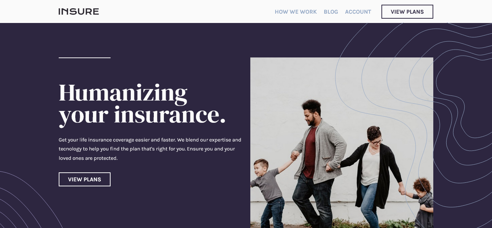
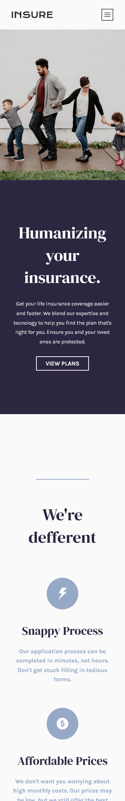

# Frontend Mentor - Insure landing page

This is a solution to the [Insure landing page challenge on Frontend Mentor](https://www.frontendmentor.io/challenges/insure-landing-page-uTU68JV8).

## Table of contents

- [Overview](#overview)
  - [The final project](#the-finalproject)
  - [Screenshot](#screenshot)
  - [Links](#links)
- [My process](#my-process)
  - [Built with](#built-with)
  - [What I learned](#what-i-learned)
- [Author](#author)

## Overview

### The final project

Users should be able to:

- View the optimal layout for the site depending on their device's screen size
- See hover states for all interactive elements on the page

### Screenshot




### Links

- Live Site URL: [Insure Landing Page](https://insure-landingpage.pages.dev/)

## My process

### Built with

- Semantic HTML5 markup
- CSS custom properties
- Flexbox
- CSS Grid
- [React](https://reactjs.org/) - JS library (TypeScript)
- [Styled Components](https://styled-components.com/) - For styles

### What I learned

Learned to use children:

```tsx
interface Props {
  children?: React.ReactNode;
}
```

Learned GlobalStyles:

```ts
export const GlobalStyles = createGlobalStyle`
  ...
`;
```

## Author

- Github - [@henriquerocharafael](https://github.com/henriquerocharafael)
- Frontend Mentor - [@henriquerocharafael](https://www.frontendmentor.io/profile/henriquerocharafael)
